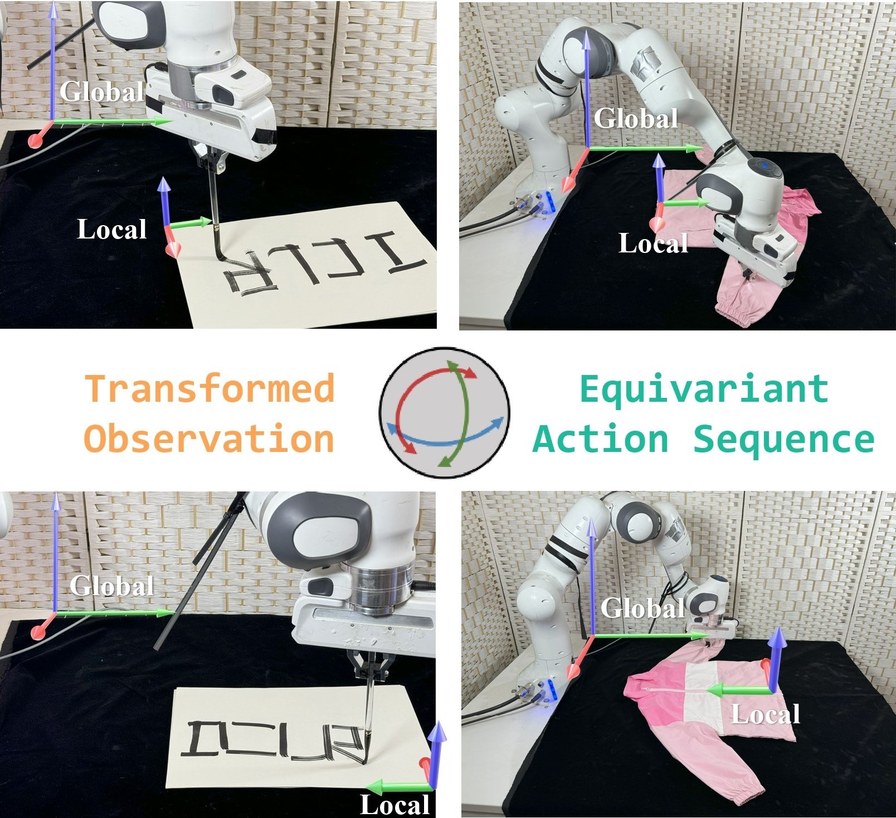

# 🔥 ET-SEED: Efficient Trajectory-Level SE(3) Equivariant Diffusion Policy
[[Project page]](https://trust-rag.github.io/) | [[Paper]](https://arxiv.org/pdf/2501.00879) | [[Video]](https://www.youtube.com/watch?v=IiOBj3ww-qA)

[Chenrui Tie*](https://crtie.github.io)<sup>1,2</sup>, [Yue Chen*](https://github.com/Cold114514)<sup>1</sup>, [Ruihai Wu*](https://warshallrho.github.io/)<sup>1</sup>, [Boxuan Dong](https://github.com/dongbx0125)<sup>1</sup>, [Zeyi Li](https://github.com/1izeyi)<sup>1</sup>, [Chongkai Gao](https://chongkaigao.com/)<sup>2</sup>, [Hao Dong](https://zsdonghao.github.io/)<sup>1</sup> 

<sup>1</sup> Peking University, <sup>2</sup> National University of Singapore

*International Conference on Learning Representations (ICLR) 2025*



This repository includes:

* Implementation of the ET-SEED method that takes point clouds as input.
* A set of manipulation environments: Open Bottle Cap, Open Door, Rotate Triangle and Calligraphy. (Garment Manipulation Environment can be found in [GarmentLab](https://github.com/GarmentLab/GarmentLab))
* Data generation, training, and evaluation scripts that accompany the above algorithms and environments.


## 🛝 Try it out!

### 🛠️ Installation

```

```

## 🙏 Acknowledgement

* Our `SE(3)-Transformer` implementation is adapted from [RiEMann](https://github.com/HeegerGao/RiEMann).
* Our `Diffusion process` implementation is adapted from [DiffusionReg](https://github.com/Jiang-HB/DiffusionReg)
* Our code refers to the implementation of [Diffusion Policy](https://github.com/real-stanford/diffusion_policy), [3D Diffusion Policy](https://github.com/YanjieZe/3D-Diffusion-Policy), [EquiBot](https://github.com/yjy0625/equibot/tree/main), [Equivariant Diffusion Policy](https://github.com/pointW/equidiff), [Diffusion-EDFs](https://github.com/tomato1mule/diffusion_edf)


## 📝 Citation and Reference

If you find this paper useful, please consider staring 🌟 this repo and citing 📑 our paper:

```
@inproceedings{tie2025etseed,
    title={{ET}-{SEED}: {EFFICIENT} {TRAJECTORY}-{LEVEL} {SE}(3) {EQUIVARIANT} {DIFFUSION} {POLICY}},
    author={Chenrui Tie and Yue Chen and Ruihai Wu and Boxuan Dong and Zeyi Li and Chongkai Gao and Hao Dong},
    booktitle={The Thirteenth International Conference on Learning Representations},
    year={2025},
    url={https://openreview.net/forum?id=OheAR2xrtb}
}
```

